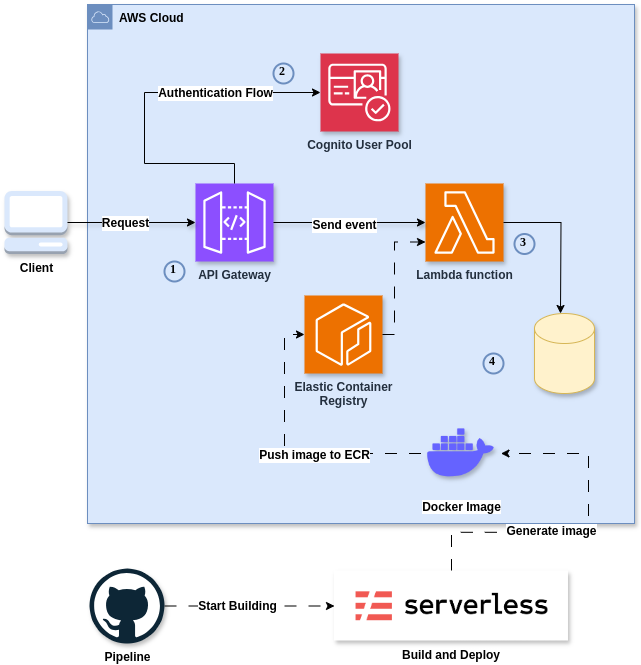
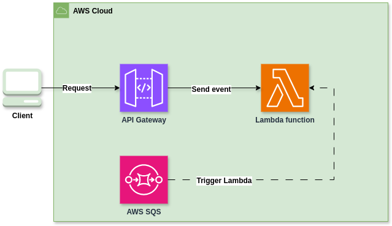
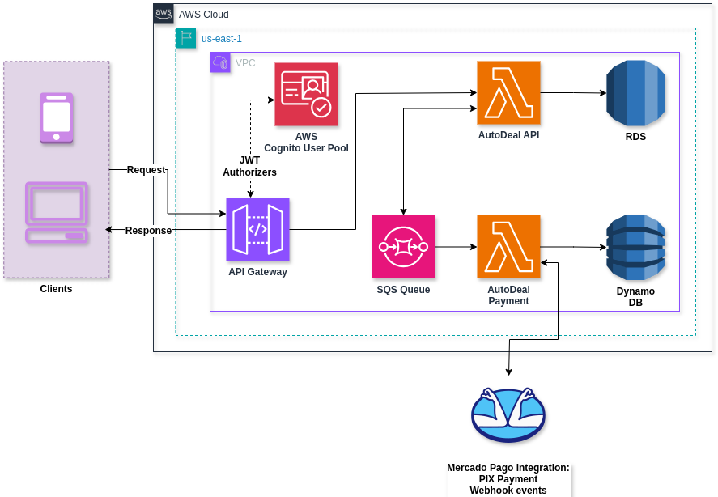
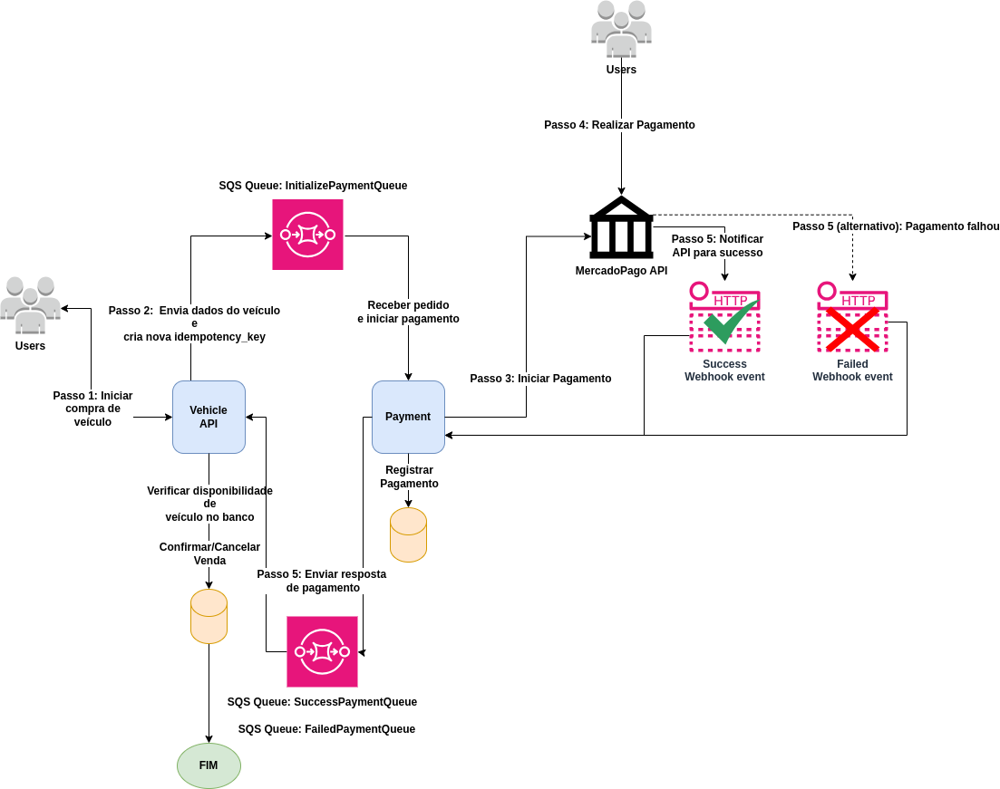
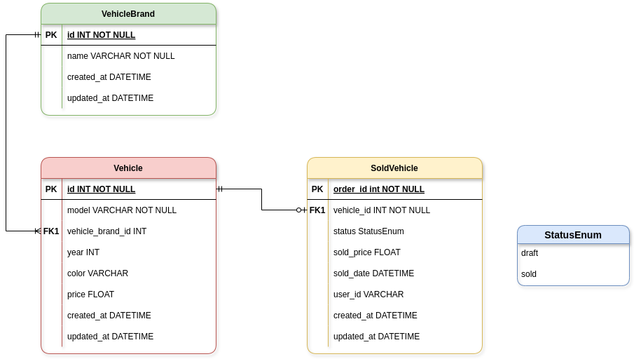

# AutoDeal User - Uma solução AWS Lambda com Docker

Aluno:

* Pedro Henrique de Marins da Silva - RM348617

## Lista de Repositórios:
  - [Repositório AutoDeal API](https://github.com/auto-deal-cars/auto-deal-api-p5)
  - [Repositório AutoDeal Payment](https://github.com/auto-deal-cars/auto-deal-payment-p5)
  - [Repositório AutoDeal User](https://github.com/auto-deal-cars/auto-deal-user)

## O Projeto

Uma empresa de revenda de veículos automotores nos contratou pois quer implantar uma
plataforma que funcione na internet, sendo assim, temos que criar a plataforma. O time de UX já está criando os designs, e ficou sob sua responsabilidade criar a API, para que posteriormente o time de frontend integre a solução. O desenho da solução envolve as seguintes necessidades do
negócio:

- Cadastrar um veículo para venda (Marca, modelo, ano, cor, preço);
- Editar os dados do veículo;
- Permitir a compra do veículo via internet para pessoas cadastradas. O cadastro deve ser feito anteriormente à compra do veículo;
- Listagem de veículos à venda, ordenada por preço, do mais barato para o mais caro;
- Listagem de veículos vendidos, ordenada por preço, do mais barato para o mais caro.

Este projeto foi gerado com o template `aws-python-docker` do [Serverless framework](https://www.serverless.com/).

Para mais detalhes, por favor, referir para a [documentação](https://www.serverless.com/framework/docs/providers/aws/).

## Evidência do projeto
Vídeo com evidências do projeto. [Link para o vídeo]

## Stack do Projeto

- **AWS Lambda:** Funções que rodam a partir de eventos gerados, podendo ser invocadas através de uma API Gateway ou SQS Queue
- **AWS API Gateway:** Criação de API endpoints para a aplicação.
- **AWS SQS:** Criação de filas do SQS para a comunicação entre os serviços.
- **AWS DynamoDB:** Banco de dados NoSQL da AWS que armazena os dados de pagamento da aplicação.
- **AWS RDS:** Banco de dados relacional da AWS que armazena os dados da aplicação.
- **AWS Cognito:** Serviço de autenticação da AWS que armazena os dados do usuário.
- **AWS Elastic Container Registry:** Registro de imagens do Docker da AWS.
- **AWS S3:** Bucket da AWS que armazena os arquivos estáticos da aplicação.
- **Python:** Linguagem de programação utilizada para a criação das funções Lambdas.
- **Docker:** Tecnologia de containerização utilizada para o build das imagens das funções Lambdas.
- **Serverless Framework:** Framework utilizado para o deploy das funções Lambdas. Responsável por transformar o serverless.yml em um template do CloudFormation.
- **Pydantic:** Biblioteca utilizada para a criação de modelos de dados para a aplicação.
- **SQLAlchemy:** Biblioteca utilizada para a criação do ORM (Object Relational Mapping) para a aplicação.
- **Boto3:** Biblioteca utilizada para a criação do cliente da AWS. Utilizado para chamar as filas.
- **Pytest:** Framework utilizado para o testes da aplicação.
- **Swagger:** Documentação da API.

## Infraestrutura

Foi escolhida uma abordagem Serverless para essa solução, utilizando o AWS Lambda para a execução das funções e o AWS API Gateway para a criação das rotas da API.
Esta arquitetura permite o desenvolvimento do código da solução sem a preocupação em gerenciamento de servidores, focando no código da solução.

As funções Lambdas podem ser invocadas a partir de eventos(triggers) para rodar código. No caso das APIs, os triggers serão rotas criadas no nível do API Gateway.

A solução requer a utilização de Docker para o build das imagens das funções Lambdas e a utilização do Serverless Framework para o deploy das funções.
Criação e deploy Lambda functions utilizando containers possui os seguintes benefícios:

- **Facilidade de manutenção**: O código da função está contido em um container, o que facilita a manutenção e o gerenciamento da infraestrutura.
- **Isolamento**: O ambiente de execução das funções é isolado do ambiente de desenvolvimento, o que facilita o gerenciamento das dependências das funções.
- **Imutabilidade**: O ambiente de execução é imutável, garantindo que o código funcione da mesma forma em diferentes ambientes.
- **Portabilidade**: Containers podem ser executados em qualquer ambiente que suporte Docker, facilitando a migração entre diferentes provedores de cloud ou ambientes on-premises.
- **Segurança**: Containers oferecem um nível adicional de isolamento, ajudando a proteger a aplicação contra vulnerabilidades.
- **Consistência**: Garantia de que o ambiente de execução é consistente em todas as fases do desenvolvimento, desde a máquina do desenvolvedor até a produção.

> **Sobre o deploy**: A infraestrutura foi configurada utilizando componentes do Serverless Framework, o que facilita o deploy das funções Lambdas. Na pasta raiz do projeto, existe um arquivo chamado `serverless.yml` que contém as configurações do deploy. Os containers gerados durante o comando de deploy são enviados para a AWS Lambda através de imagens que são geradas e encaminhadas para o ECR (Elastic Container Registry) da AWS.

### Utilização de arquitetura arm64 nas funções Lambdas

A arquitetura X86 é a primeira opção quando falamos de computadores e servidores. Porém, os avanços da arquitetura ARM estão cada vez mais presentes. Oferecendo muitos benefícios, como menor custo, maior velocidade e eficiência.

O processador Graviton2 é um processador que foi oferecido pela AWS para a arquitetura ARM. O Graviton2 já provou ter performance impressionante em comparação com processadores da família X86, impulsionando o desempenho dos serviços.

Essa arquitetura foi escolhida por ser uma arquitetura que oferece suporte ao processamento de forma mais rápida e eficiente.
Além disso, utilizar a arquitetura ARM oferece o benefício de reduzir a emissão de gases de efeito estufa.

### Cognito User Pool para autenticação

O serviço de autenticação foi implementado utilizando o Cognito User Pool, que é um serviço da AWS que oferece autenticação e autorização para aplicações web. Essa solução foi escolhida por ser uma solução de autenticação que oferece suporte ao OAuth 2.0, o que facilita a implementação de autenticação e autorização em aplicações front-end.

### Triggers das Lambdas: API Gateway e SQS Queues

As funções Lambdas possuem triggers configurados para rodarem a partir de eventos gerados, dois tipos de triggers são utilizados: 
- **API Gateway**: As funções são invocadas a partir de eventos gerados pelo API Gateway, que são as rotas da API. Funções utilizando essa solução fazem parte da criação de API endpoints. Essas API endpoints podem ser utilizadas em um client (aplicação front-end), e são protegidas por meio de um JWT Authorizer
- **SQS Queues**: As funções são invocadas a partir de eventos gerados pelo SQS Queues, que são as filas do SQS. Essa abordagem é utilizada para comunicação entre os serviços.

> **Sobre JWT Authorizers**: O JWT Authorizer é um componente do API Gateway que permite a criação de um Authorizer que valida o JWT (JSON Web Token) enviado pelo client. Esse Authorizer é utilizado para proteger as API endpoints, garantindo que somente usuários autenticados possam acessar essas endpoints. Os tokens são gerados por meio do serviço de autenticação, utilizando a solução AWS Cognito User Pool.

### Pipeline

A pipeline para deploy do código foi configurada utilizando o GitHub Actions, a pipeline possui os seguintes passos:

- **Checkout code**: Utiliza a ação `actions/checkout@v2` para fazer o checkout do código fonte do repositório.
- **Set up Python**: Configura o ambiente Python usando `actions/setup-python@v4` com a versão 3.10.
- **Install dependencies**: Instala as dependências do projeto listadas no arquivo `requirements.txt` e o `pytest` para testes.
- **Run tests**: Executa os testes utilizando `pytest` para garantir que o código está funcionando corretamente.
- **Create envfile**: Cria um arquivo `.env` com a variável `DATABASE_URL` utilizando a ação `SpicyPizza/create-envfile@v2.0`.
- **Run Alembic migrations**: Executa as migrações do banco de dados utilizando `alembic upgrade head`.
- **Set up QEMU**: Configura o QEMU para emulação da arquitetura ARM para realizar o build da imagem Docker, usando a ação `docker/setup-qemu-action@v3`.
- **Deploy if tests pass**: Se os testes passarem, instala o Serverless Framework e plugins necessários, e realiza o deploy da aplicação utilizando `sls deploy`.
- **Clean up env.json file**: Remove o arquivo `env.json` após o deploy ser realizado com sucesso.

> **Sobre a utilização do QEMU**: O Github Actions não suporta a emulação da arquitetura ARM nativamente, porém, o QEMU permite a emulação da arquitetura ARM para construir a imagem Docker.

### Regras gerais para utilização

- **Branches**: As branchs do projeto devem seguir o padrão `feature_<nome-da-feature>` para novas features, e `fix_<nome-do-bug>` para correções de bugs.
- **Commits**: Os commits do projeto devem seguir o padrão `<tipo>: <descrição>`. Os tipos possíveis são: `feat`, `fix`, `perf`, `docs`, `style`, `refactor`, `test`, `chore`, `ci`, `build`, `revert`.
- **Pull Requests**: Código só pode ser mergeado para a branch `main` através de pull requests.
- **CI/CD**: A aplicação possui CI/CD através do GitHub Actions, onde o código é buildado e deployado para a AWS Lambda através do Serverless Framework.
- **Documentação das APIs**: A documentação do projeto foi feita utilizando o Swagger, e está disponível na raiz do projeto, no arquivo `openapi.yml`. Para rodar localmente, utilize o comando `swagger-ui-express --config openapi.yml --port 8080`.

> **Sobre o Swagger**: É recomendado utilizar a documentação do Swagger após o primeiro deploy, pois é necessário configurar o endpoint do API Gateway no Swagger. Os endpoints estão documentados e todas as os possíveis models de request e response estão documentados no Swagger.

## Arquitetura

A abordagem de microserviços utilizando funções Lambda foi escolhida por ser uma abordagem que oferece suporte ao desenvolvimento de uma aplicação distribuída, onde cada serviço possui seu próprio banco de dados, e a comunicação entre os serviços é feita através de mensagens (SQS Queues).
No caso do serviço de compra de veículo, o serviço chamado API de veículo envia uma mensagem para a fila do SQS, que é processada pelo serviço de Payment de veículo.

### Funções utilizando conceitos de Arquitetura Hexagonal
A abordagem de arquitetura hexagonal também pode ser utilizada para a criação de funções Lambda, utilizando o conceito de **Ports e Adapters**. Alguns detalhes sobre atores:

  - Condutores: (ou atores primários): Podem ser definidos como atores que iniciam a interação. Por exemplo, um condutor pode ser um controller que recebe um input de um usuário e redireciona a aplicação utilizando uma Port(interface).
  - Conduzidos: (também conhecido como atores secundários): São parte da camada de infrasctructure da aplicação. Podem ser utilizados para adicionar funcionalidades para o domínio da aplicação. Exemplos: Banco de dados, APIs externas.

Também é possível dizer que a aplicação foi implementada seguindo o conceito de Clean Architecture, onde a aplicação é dividida em camadas, e cada camada possui sua responsabilidade. Alguns detalhes sobre os padrões:

- **Application Services**: Camada de serviços da aplicação, responsável por conter a lógica de negócios da aplicação.
- **Domain**: Camada de domínio da aplicação, responsável por conter as entidades da aplicação.
- **Infrastructure**: Camada de infraestrutura da aplicação, responsável por conter as portas e adaptadores da aplicação.
- **Controllers**: Camada de controllers da aplicação, responsável por conter os controllers da aplicação.
- **Adapters**: Camada de adaptadores da aplicação, responsável por conter os adaptadores da aplicação.
- **Repositories**: Camada de repositórios da aplicação, responsável pelas operações de banco de dados.
- **Decorators**: Decorators são utilizados para adicionar funcionalidades aos controllers, neste caso, para adicionar a lógica responsável por validar exceptions e retornar as respostas corretas para o usuário.

### Padrão SAGA

A abordagem de mensagens utilizando filas do SQS permite a comunicação entre os serviços de Vehicle e Payment, garantindo a confiabilidade e integridade dos dados em caso de erros. Mesmo utilizando uma solução distribuída de banco de dados, garantindo a consistência.
Adicionamente, o padrão SAGA utilizado para essa aplicação é o padrão Coreografia, onde não existe um orquestrador, e cada saga é uma transação.
Para cobrir falhas, a aplicação possui a seguinte estratégia:
  - **Compensação**: Eventos compensatórios para reverter vendas, caso ocorra algum erro.
  - **Chave de idempotência**: Identificador único para garantir que uma transação seja executada apenas uma vez.
  - ** SQS Queues utilizando padrão FIFO**: Garante a ordem de execução das mensagens, evitando problemas de concorrência. Também garante que uma mensagem seja processada apenas uma vez.

### Modelo de dados (RDS)

O modelo de dados do serviço API é um banco de dados relacional, utilizando o RDS (PostgreSQL) como serviço de banco de dados. O banco de dados possui as seguintes tabelas:
- **Vehicle**: Tabela que armazena os veículos disponíveis à venda.
- **VehicleBrand**: Tabela que armazena as marcas de veículos.
- **SoldVehicle**: Tabela que armazena os veículos vendidos.
- **Enum: StatusEnum**: Tabela que armazena os status dos veículos vendidos. Possíveis valores:
  - **draft**: Venda inicializada. Veículos com este status são removidos da lista de veículos disponíveis à venda.
  - **awaiting_pickup**: Aguardando retirada do veículo que já foi vendido.
  - **sold**: Venda concluída. Não é possível reverter a venda pois o veículo já foi retirado.

#### Estrutura das tabelas
##### Vehicle
| Coluna       | Tipo         | Descrição                        |
|--------------|--------------|----------------------------------|
| id           | Integer      | Identificador único do veículo   |
| brand_id     | Integer      | Identificador da marca do veículo|
| model        | String       | Modelo do veículo                |
| year         | Integer      | Ano do veículo                   |
| color        | String       | Cor do veículo                   |
| price        | Float        | Preço do veículo                 |
| created_at   | Timestamp    | Data da criação do veículo        |
| updated_at   | Timestamp    | Data da ltima atualização do veículo |

##### VehicleBrand
| Coluna       | Tipo         | Descrição                        |
|--------------|--------------|----------------------------------|
| id           | Integer      | Identificador único da marca     |
| name         | String       | Nome da marca                    |
| created_at   | Timestamp    | Data da criação da marca        |
| updated_at   | Timestamp    | Data da ltima atualização da marca |

##### VehicleSold
| Coluna       | Tipo         | Descrição                        |
|--------------|--------------|----------------------------------|
| order_id     | Integer      | Identificador único da venda     |
| vehicle_id   | Integer      | Identificador do veículo vendido |
| status       | StatusEnum   | Status da venda do veículo       |
| sold_price   | Float        | Preço pelo qual o veículo foi vendido |
| sold_date    | Timestamp    | Data da venda                    |
| user_id      | Integer      | Identificador do usuário que comprou o veículo |
| created_at   | Timestamp    | Data da criação da venda        |
| updated_at   | Timestamp    | Data da ltima atualização da venda |

##### Enum: StatusEnum
| Valor        | Descrição                        |
|--------------|----------------------------------|
| draft        | Venda inicializada               |
| awaiting_pickup        | Aguardando retirada do veículo que já foi vendido |
| sold         | Venda concluída                  |

### Modelo de dados (DynamoDB)
Abaixo, está a estrutura do modelo de dados do serviço Payment.

#### Payment
| Coluna           | Tipo   | Descrição                                      |
|------------------|--------|------------------------------------------------|
| idempotency_key  | String | Chave de idempotência para garantir operações únicas |
| payment_id       | Number | Identificador único do pagamento gerado pelo Mercado Pago|
| status           | String | Status do pagamento                            |
| order_id         | Number | Identificador do pedido                        |
| vehicle_id       | Number | Identificador do veículo                       |
| created_at       | String | Data de criação do pagamento                   |
| updated_at       | String | Data da última atualização do pagamento  

## Rotas

# AutoDeal User
**POST /user**: cadastro de usuário.
**POST /login**: login de usuário.
**DELETE /user**: deletar usuário.

## AutoDeal API

- **POST /payment**: Criação de um pagamento.
- **GET /payment**: Busca os pagamentos.
- **GET /payment/{id}**: Busca um pagamento pelo seu ID.
- **POST /vehicle**: Criação de um veículo.
- **PUT /vehicle/{id}**: Atualização dos dados de um veículo.
- **GET /vehicle/{id}**: Busca os dados de um veículo pelo seu ID.
- **GET /vehicles**: Listagem de veículos disponíveis à venda.
- **GET /vehicles/sold**: Listagem de veículos vendidos.
- **POST /vehicle/{id}/initialize-sale**: Inicialização da venda de um veículo.
- **DELETE /vehicle/{id}**: Cancelamento da venda de um veículo que não foi pago.
- **POST /vehicle/{id}/confirm-pickup**: Confirmação de retirada de um veículo que já foi vendido.

## AutoDeal Payment

- **POST /webhook**: Recebe notificação de webhook.
- **GET /payment**: Busca os pagamentos realizados/pendentes.

## Segurança

Estes microsserviços são protegidos boas práticas de segurança, como por exemplo:
- **Autenticação e autorização**: Protegidos por meio de autenticação e autorização utilizando o JWT Authorizer.
- **CORS**: Protegidos por meio de CORS para evitar ataques de Cross-Site Request Forgery (CSRF).
- **Rate Limiting**: Protegidos por meio de rate limiting para evitar ataques de força bruta.
- **Scopes**: Protegidos por meio de scopes para evitar ataques de Cross-Site Request Forgery (CSRF).
- **HTTPS**: Protegidos por meio de HTTPS para evitar ataques de man-in-the-middle.
- **IAM Roles**: Protegidos por meio de IAM Roles. Eles são utilizados principalmente para proteger o serviço de Payment, que utiliza o DynamoDB como banco de dados.

Abaixo, mais detalhes sobre a segurança de cada serviço:

### Dados dos usuários

Os dados dos usuários são armazenados no Cognito User Pool, que é um serviço da AWS que oferece autenticação e autorização para aplicações web. É utilizada a solução de custom attributes para armazenar os dados específicos do usuário, que são gerados para criação do pagamento no método PIX.

Dados que são armazenados no Cognito User Pool:
- **name**: Nome do usuário.
- **email**: Email do usuário.
- **cpf**: CPF do usuário.
- **accepted_terms**: Se o usuário aceitou os termos de uso da aplicação e aceitou que seus dados serão utilizados para criação do pagamento.
- **endereço**: Endereço do usuário. Que inclui:
  - **street**: Rua do usuário.
  - **number**: Número do usuário.
  - **city**: Cidade do usuário.
  - **state**: Estado do usuário.
  - **zip_code**: CEP do usuário.

#### Implicações da LGPD

Esta aplicação apenas armazena os dados dos usuários no Cognito User Pool, e não armazena os dados em nenhum outro banco de dados. Portanto, não há necessidade de utilizar o serviço de PII (Personal Identifiable Information) da AWS.
Além disso, a aplicação só permite a criação de usuários que aceitaram os termos de uso da aplicação, incluindo que seus dados serão utilizados para criação do pagamento.

Também é importante destacar que a qualquer momento, o usuário pode solicitar a remoção de seus dados, e a aplicação irá remover os dados do Cognito User Pool.

#### Lista de scopes

Os usuários estão divididos em dois grupos diferentes, que possuem diferentes permissões:
- **buyer**: Permite a criação de usuários.
- **admin**: Permite a criação de usuários e acesso a todas as rotas da aplicação.

Os scopes são criados utilizando uma solução chamada `Pre Token Generation Lambda`, uma solução da AWS que permite a criação de scopes dinamicamente. Essa solução permite o seguinte:
Antes da criação do token, a aplicação verifica se o usuário possui o scope `admin` ou `buyer`, e adiciona scopes automaticamente ao access token.

Esse processo é feito utilizando uma função Lambda, que é configurada no Cognito User Pool.

Lista de scopes:
- **delete:user**: Permite remover o usuário (apenas admin podem utilizar, recurso utilizado para apagar usuários e seus dados).
- **create:vehicle**: Permite a criação de veículos. (apenas admin podem utilizar)
- **update:vehicle**: Permite a atualização de veículos. (apenas admin podem utilizar)
- **delete:vehicle**: Permite a remoção de veículos. (apenas admin podem utilizar)
- **get:vehicle**: Permite a leitura de veículos.
- **list:available**: Permite a listagem de veículos disponíveis à venda.
- **list:sold**: Permite a listagem de veículos vendidos. (apenas admin podem utilizar)
- **initialize:sale**: Permite a inicialização da venda de um veículo.
- **cancel:sale**: Permite o cancelamento da venda de um veículo.
- **pick:sale**: Permite a confirmação de retirada de um veículo que já foi vendido.

## Como rodar o projeto

Para rodar este projeto, é recomendado utilizar o ambiente de desenvolvimento da AWS, o projeto precisa de um arquivo `.env` com as variáveis de ambiente necessárias para o funcionamento da aplicação. Utilize o arquivo `.env.example` como referência para criar o arquivo `.env`.

Este projeto requer um mínimo de requisitos para rodar, sendo eles:
- AWS CLI configurado
- Node.js
- NPM
- Serverless Framework
- Python
- Pip

Além disso, alguns serviços da AWS são necessários para o funcionamento da aplicação, como:
- AWS Lambda (são criados no serverless.yml)
- AWS API Gateway (são criados no serverless.yml)
- AWS SQS (São criados no serverless.yml)
- AWS DynamoDB (São criados no serverless.yml)
- AWS RDS (São criados no serverless.yml)
- AWS Cognito (São criados no serverless.yml)
- Conta do Mercado Pago

> **Sobre resources criadas com o Serverless Framework**: Os recursos criados pelo Serverless Framework são criados na conta da AWS que está configurada no AWS CLI. Serverless Framework cria os recursos utilizando templates do CloudFormation.

Atenção importante preencher o arquivo env.json com as variáveis de ambiente necessárias para o funcionamento da aplicação. Existe um arquivo `.env.example` que pode ser utilizado como referência.

Após clonar o repositório, utilize o comando `npm install` para instalar as dependências do projeto, e `sls deploy` para rodar o projeto, sem esquecer de passar os params no comando.
